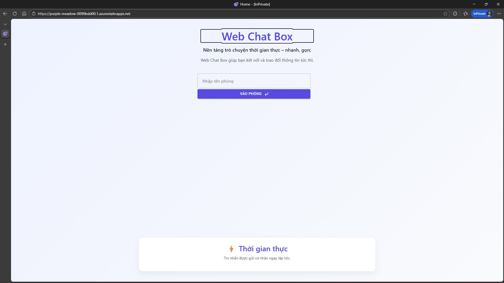
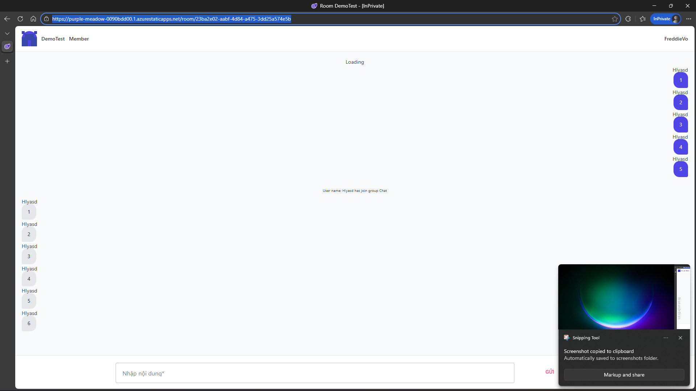

# 💬 Demo Chat SignalR - Ephemeral Realtime Communication

Một ứng dụng Chat Realtime hiện đại được xây dựng trên nền tảng **Blazor WebAssembly** và **SignalR Core**. Dự án triển khai mô hình Hybrid-Cloud và áp dụng cơ chế lưu trữ tạm thời nhằm tối ưu hóa quyền riêng tư của người dùng.

---

## 📸 Preview Dự án

*Giao diện phòng chat trực quan và realtime*

*Hỗ trợ đa thiết bị và hiển thị trạng thái người dùng*

---

## ✨ Tính năng nổi bật

* **Realtime Messaging:** Truyền tải tin nhắn tức thời với độ trễ cực thấp qua SignalR Hub.
* **Ephemeral Chat (Privacy Focus):** - Toàn bộ tin nhắn được lưu trữ **In-memory** phía Server.
    - Hệ thống tự động giải phóng bộ nhớ và xóa lịch sử chat sau **30 phút**, đảm bảo không lưu lại dấu vết dữ liệu vĩnh viễn.
* **Presence Tracking:** Theo dõi và hiển thị danh sách người dùng đang trực tuyến (Online) trong thời gian thực.
* **Hybrid-Cloud Deployment:** - **Frontend:** Triển khai trên Azure Static Web Apps với cấu hình Fallback Routing (tránh lỗi 404 khi truy cập trực tiếp link phòng).
    - **Backend:** Triển khai trên Zeabur để tối ưu hóa kết nối WebSocket/SignalR.

## 🛠 Công nghệ sử dụng

- **Frontend:** Blazor WebAssembly (.NET 8/9)
- **Backend:** ASP.NET Core Web API & SignalR Hub
- **Hosting:** Azure (Client) & Zeabur (Server)

## 🏗 Kiến trúc hệ thống

Dự án sử dụng cơ chế kết nối tách biệt để tối ưu tài nguyên:
- **Client:** `https://purple-meadow-0090bdd00.1.azurestaticapps.net`
- **Server Hub:** `https://demoblazor.zeabur.app`

## 🚀 Link trải nghiệm nhanh
[Vào trực tiếp phòng chat demo](https://purple-meadow-0090bdd00.1.azurestaticapps.net/room/0a0852cc-1ceb-442c-ae11-72dba99fa01c)

---

## 👨‍💻 Tác giả

Phát triển bởi **freddievo1399**. 
Dự án là minh chứng cho việc làm chủ công nghệ SignalR và tư duy quản lý tài nguyên hệ thống hiệu quả.

---
⭐ **Nếu bạn thích ý tưởng Ephemeral Chat này, hãy tặng mình 1 sao (Star) nhé!**